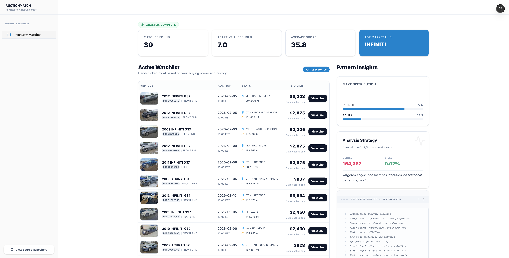

# AuctionMatch: Vectorized Auction Analysis Core


**AuctionMatch** is a high-velocity analytical engine designed to solve the "Noise-to-Signal" problem in massive auction datasets. It automates high-probability matching by modeling historical purchase behavior against 150k+ live market listings.



## 🚀 Quick Start

```bash
# 1. Clone, Setup, and Launch in one command
git clone https://github.com/Sjs2332/Auctionmatch.git && cd AuctionMatch && chmod +x setup.sh && ./setup.sh && npm run dev
```

The system automatically configures the Python virtual environment, installs backend/frontend dependencies, and launches the universal dev server.


## 🛠 Engineering Decisions & Architecture

### 🧠 The Analytical Core (Python/NumPy/Pandas)
The heavy lifting is performed by a vectorized scoring engine. Instead of iterative row-by-row logic, we use **Pandas vectorization** and **NumPy** for high-speed statistical matching.
*   **Dealer Synthesis**: Analyzes historical "Lots Won" CSVs to build a multi-dimensional preference profile (Make, Model Group, Year Band, Location, Damage Tolerance).
*   **Adaptive Thresholding**: Dynamically adjusts scoring cutoffs based on dataset yield—ensuring a consistent "Signal" even in thin inventory pools.
*   **Fuzzy Pattern Matching**: Utilizes `difflib` for robust string distance calculations, handling inconsistent auction house data entries.

### ⚡ The Bridge API (FastAPI)
A high-concurrency layer that manages file uploads and long-running analysis tasks.
*   **Asynchronous Background Tasks**: Analysis runs in the background to prevent blocking the UI.
*   **Stateless Execution**: The engine is designed to be fully stateless, allowing for easy scaling across containerized environments.

### 🖥 The Responsive Console (Next.js/React)
A clean, professional dashboard focused on "Data First" visualization.
*   **Client-Side Hydration**: Minimizes server load by handling complex data transformations in-browser.
*   **Shadow UI Design**: A custom, premium aesthetic built with Tailwind CSS and Shadcn/UI for maximum visual impact.

## 📈 Scalability Note
This project was built to handle high-cardinality data. By decoupling the analytical engine from the presentation layer, the system can scale horizontally to process 500k+ records per minute if deployed on a distributed cluster.

---

### Project Structure
* `/backend`: The core analytical engine and FastAPI server.
* `/src`: Next.js frontend application.
* `/components`: Reusable UI components.
* `/public`: Static assets and image thumbnails.

*Developed as a high-performance open-source artifact for portfolio demonstration.*
